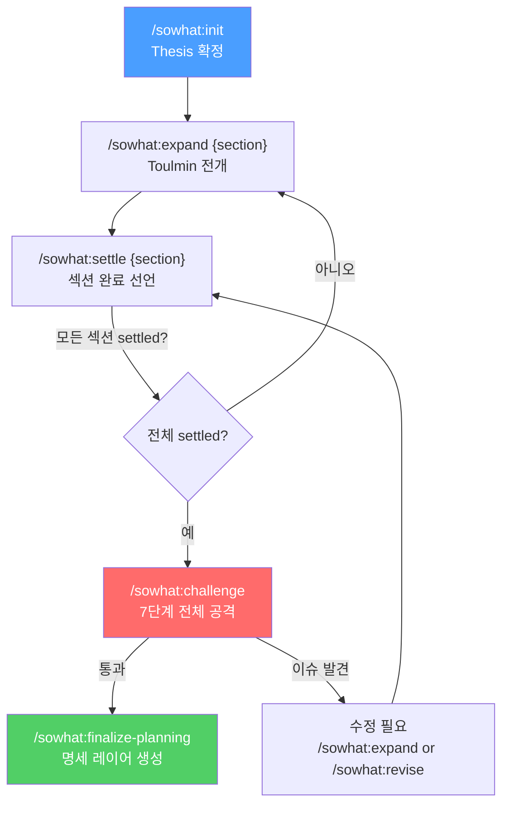
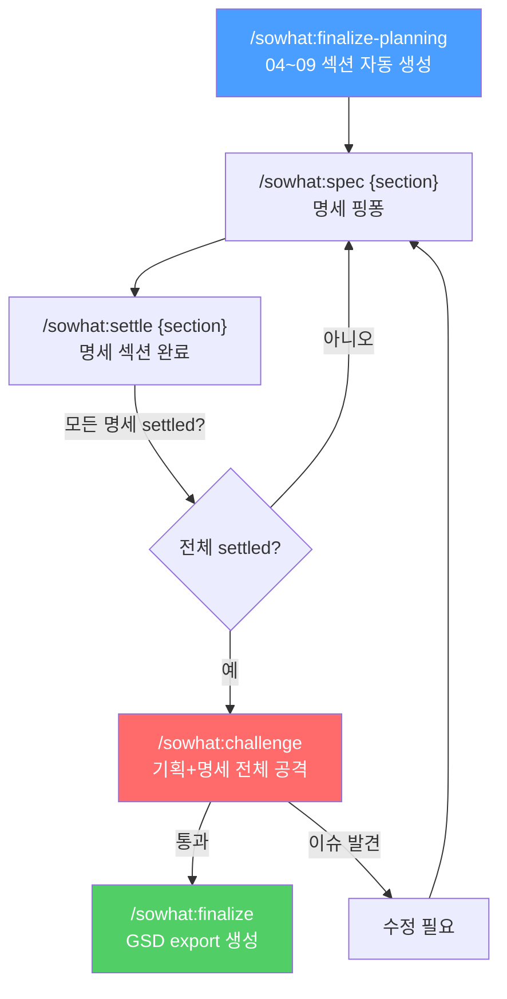
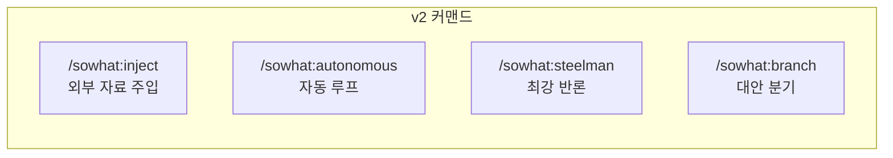

# Command Flow — sowhat 워크플로우 흐름도

## 전체 흐름 (Planning Layer)



## 전체 흐름 (Spec Layer)



## 보조 커맨드 (언제든 사용 가능)

```mermaid
flowchart LR
    subgraph 논증 강화
        DEBATE["/sowhat:debate<br/>3-agent 변증법"]
        RESEARCH["/sowhat:research<br/>외부 근거 수집"]
    end

    subgraph 수정·복구
        REVISE["/sowhat:revise<br/>settled 섹션 수정"]
        SNAPSHOT["/sowhat:snapshot<br/>논증 스냅샷"]
        SYNC["/sowhat:sync<br/>GitHub 동기화"]
        RESUME["/sowhat:resume<br/>세션 재개"]
    end

    subgraph 조회·산출
        PROGRESS["/sowhat:progress<br/>대시보드"]
        MAP["/sowhat:map<br/>논증 시각화"]
        DRAFT["/sowhat:draft<br/>문서 생성"]
        NOTE["/sowhat:note<br/>아이디어 메모"]
    end

    subgraph 콘텐츠 분석
        CRITIC["/sowhat:critic<br/>대상 5차원 비평"]
        CHARACTER["/sowhat:character<br/>글쓰기 캐릭터"]
    end
```

### 추가 커맨드 (v2)

| 커맨드 | 위치 | 설명 |
|--------|------|------|
| `/sowhat:inject {section} {source}` | expand/settle 사이 | 외부 자료를 특정 필드에 직접 주입 |
| `/sowhat:autonomous` | 전체 파이프라인 대체 | expand→debate→settle 자동 루프 |
| `/sowhat:steelman` | challenge 이후 | 최강 반대 논증 트리 생성 |
| `/sowhat:branch {section}` | expand 전후 | 대안 논증 분기 탐색 |



## 커맨드 간 트리거 관계

| 소스 커맨드 | 트리거 | 대상 커맨드 |
|------------|--------|-----------|
| init | thesis settled 후 | expand (첫 섹션) |
| expand | 전개 완료 후 | settle |
| settle | settle 성공 후 | expand (다음 섹션) 또는 challenge |
| challenge | 이슈 발견 시 | expand / revise |
| challenge | 통과 시 | finalize-planning / finalize |
| finalize-planning | 명세 생성 후 | spec (첫 명세 섹션) |
| debate | merge 후 | settle 또는 expand |
| revise | 수정 후 | expand (역전파된 섹션) |
| research | accept 후 | expand (해당 섹션 Grounds 보강) |
| character | 캐릭터 완성 후 | draft (캐릭터 적용) |
| critic | 비평 완료 후 | expand 또는 debate (약점 주입) |
| snapshot | restore 후 | expand (needs-revision 섹션) |
| challenge | 실행 전 (auto) | snapshot (자동 백업) |
| finalize-planning | 완료 후 (auto) | snapshot (자동 기록) |
| add-argument | 추가 후 (auto) | snapshot (자동 기록) |
| note | promote 후 | expand (해당 섹션 Open Question) |

## 섹션 Status와 사용 가능 커맨드

| Status | 사용 가능 | 사용 불가 |
|--------|----------|----------|
| `draft` | expand, snapshot | settle, debate, revise |
| `discussing` | expand, debate, settle, research, snapshot | — |
| `settled` | revise, debate, challenge, snapshot | expand |
| `needs-revision` | expand, revise, debate, snapshot | settle |
| `invalidated` | expand (상위 해결 후), revise, snapshot | settle, debate |
